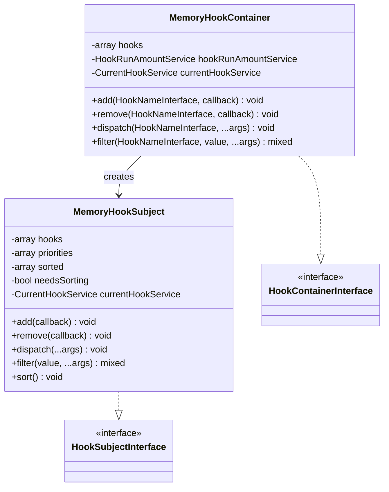
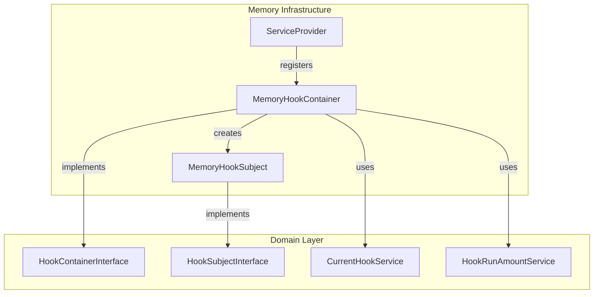
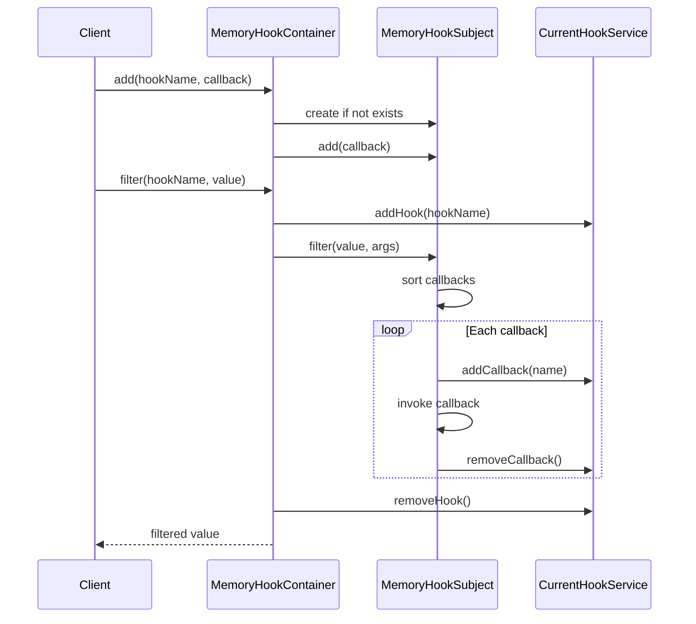
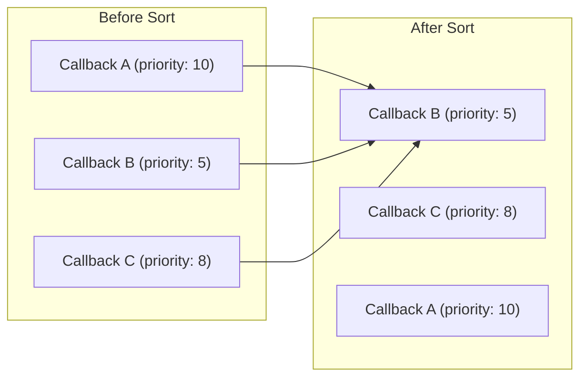
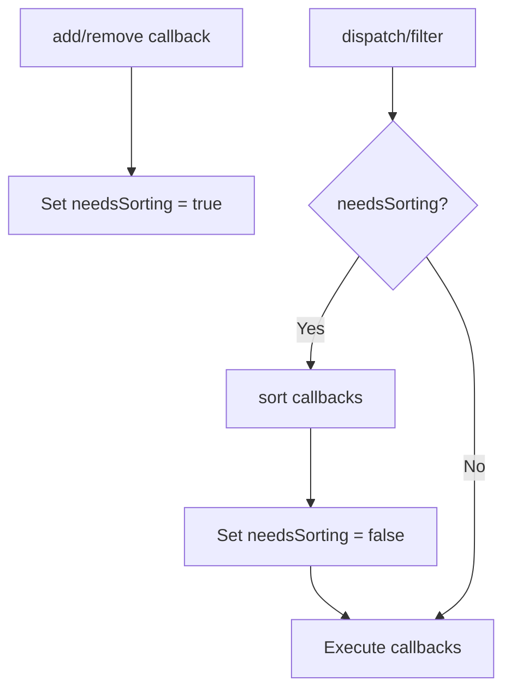
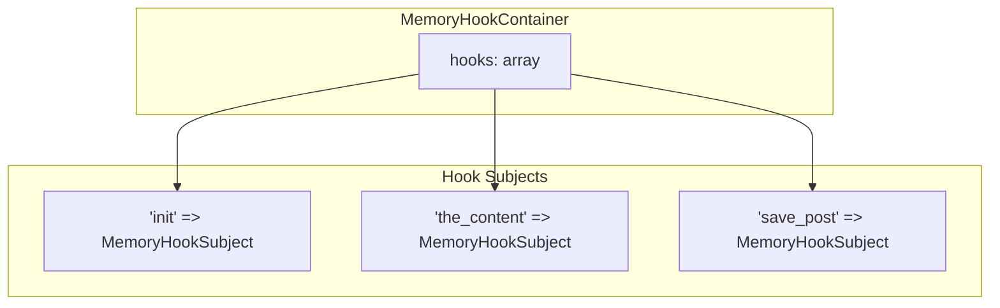
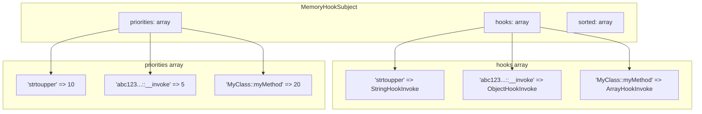

# Services

This document provides detailed documentation for the memory infrastructure services.

## Overview



### Architecture



### Key Components

| Component | Description |
|-----------|-------------|
| `MemoryHookContainer` | Main container implementing `HookContainerInterface`. Manages all hooks in memory. |
| `MemoryHookSubject` | Individual hook subject implementing `HookSubjectInterface`. Stores callbacks for a single hook. |
| `CalledDeprecatedHook` | Handles deprecated hook notifications, implementing `CalledDeprecatedHookInterface`. |
| `ServiceProvider` | Convenience class for registering all memory infrastructure services. |

---

## MemoryHookContainer

The main container that manages all hooks in memory. Implements `HookContainerInterface` from the domain package.

**Namespace:** `SpeedySpec\WP\Hook\Infra\Memory\Services`

### Constructor

```php
public function __construct(
    private HookRunAmountService $hookRunAmountService,
    private CurrentHookService $currentHookService,
)
```

| Parameter | Type | Description |
|-----------|------|-------------|
| `$hookRunAmountService` | `HookRunAmountService` | Service to track how many times each hook has run |
| `$currentHookService` | `CurrentHookService` | Service to track the currently executing hook |

### Methods

#### add()

Registers a callback for a hook.

```php
public function add(
    HookNameInterface $name,
    HookInvokableInterface|HookActionInterface|HookFilterInterface $callback
): void
```

| Parameter | Type | Description |
|-----------|------|-------------|
| `$name` | `HookNameInterface` | The hook name (e.g., `StringHookName`) |
| `$callback` | `HookInvokableInterface\|HookActionInterface\|HookFilterInterface` | The callback to register |

**Example:**

```php
use SpeedySpec\WP\Hook\Domain\Entities\ObjectHookInvoke;
use SpeedySpec\WP\Hook\Domain\ValueObject\StringHookName;

$container->add(
    new StringHookName('the_content'),
    new ObjectHookInvoke(fn($content) => wpautop($content), priority: 10)
);
```

#### remove()

Removes a callback from a hook.

```php
public function remove(
    HookNameInterface $name,
    HookInvokableInterface|HookActionInterface|HookFilterInterface $callback
): void
```

| Parameter | Type | Description |
|-----------|------|-------------|
| `$name` | `HookNameInterface` | The hook name |
| `$callback` | `HookInvokableInterface\|HookActionInterface\|HookFilterInterface` | The callback to remove |

**Example:**

```php
// Store the callback reference to remove later
$callback = new ObjectHookInvoke(fn($content) => $content, priority: 10);
$hookName = new StringHookName('the_content');

$container->add($hookName, $callback);
// Later...
$container->remove($hookName, $callback);
```

#### dispatch()

Executes all callbacks for an action hook.

```php
public function dispatch(HookNameInterface $hook, ...$args): void
```

| Parameter | Type | Description |
|-----------|------|-------------|
| `$hook` | `HookNameInterface` | The hook name to dispatch |
| `...$args` | `mixed` | Arguments passed to each callback |

**Example:**

```php
$container->dispatch(new StringHookName('init'));
$container->dispatch(new StringHookName('save_post'), $postId, $post);
```

#### filter()

Passes a value through all callbacks for a filter hook.

```php
public function filter(HookNameInterface $hook, mixed $value, ...$args): mixed
```

| Parameter | Type | Description |
|-----------|------|-------------|
| `$hook` | `HookNameInterface` | The hook name |
| `$value` | `mixed` | The initial value to filter |
| `...$args` | `mixed` | Additional arguments passed to callbacks |

**Returns:** The filtered value after passing through all callbacks.

**Example:**

```php
$content = $container->filter(
    new StringHookName('the_content'),
    $rawContent,
    $postId
);
```

### Lifecycle



---

## MemoryHookSubject

Represents a single named hook and manages its registered callbacks. Implements `HookSubjectInterface` from the domain package.

**Namespace:** `SpeedySpec\WP\Hook\Infra\Memory\Services`

### Constructor

```php
public function __construct(
    private CurrentHookService $currentHookService,
)
```

| Parameter | Type | Description |
|-----------|------|-------------|
| `$currentHookService` | `CurrentHookService` | Service to track current callback execution |

### Methods

#### add()

Adds a callback to this hook subject.

```php
public function add(
    HookInvokableInterface|HookActionInterface|HookFilterInterface $callback
): void
```

The priority is automatically extracted from callbacks implementing `HookPriorityInterface`. If the callback doesn't implement `HookPriorityInterface`, a default priority of 10 is used.

**Example:**

```php
$subject = new MemoryHookSubject($currentHookService);

// Callback with explicit priority
$subject->add(new ObjectHookInvoke(fn($v) => $v, priority: 5));

// Default priority (10)
$subject->add(new ObjectHookInvoke(fn($v) => $v));
```

#### remove()

Removes a callback from this hook subject.

```php
public function remove(
    HookInvokableInterface|HookActionInterface|HookFilterInterface $callback
): void
```

**Example:**

```php
$callback = new ObjectHookInvoke(fn($v) => $v, priority: 10);
$subject->add($callback);
$subject->remove($callback);
```

#### dispatch()

Executes all callbacks (action-style execution).

```php
public function dispatch(...$args): void
```

Each callback receives the same arguments. Return values are ignored.

**Example:**

```php
$subject->add(new ObjectHookInvoke(fn($msg) => error_log($msg)));
$subject->dispatch('Something happened');
```

#### filter()

Passes a value through all callbacks (filter-style execution).

```php
public function filter(mixed $value, ...$args): mixed
```

Each callback receives the output of the previous callback as its first argument. Additional arguments are passed unchanged.

**Example:**

```php
$subject->add(new ObjectHookInvoke(fn($v) => $v . '_first', priority: 10));
$subject->add(new ObjectHookInvoke(fn($v) => $v . '_second', priority: 20));

$result = $subject->filter('start');
// Result: 'start_first_second'
```

#### sort()

Manually triggers sorting of callbacks by priority.

```php
public function sort(): void
```

Sorting happens automatically when needed, but you can call this method if you want to pre-sort callbacks.

### Priority Sorting



Callbacks are sorted in ascending priority order (lower numbers execute first):

```php
$subject->add(new ObjectHookInvoke($callbackA, priority: 10));  // Third
$subject->add(new ObjectHookInvoke($callbackB, priority: 5));   // First
$subject->add(new ObjectHookInvoke($callbackC, priority: 8));   // Second

$subject->filter('value');
// Execution order: B, C, A
```

### Lazy Sorting

The subject uses lazy sorting to optimize performance:



- Sorting only happens when callbacks are actually executed
- Multiple adds/removes don't trigger redundant sorts
- The `sorted` array is cached until callbacks change

---

## CalledDeprecatedHook

Handles deprecated hook functionality by triggering deprecation notices when deprecated hooks are executed.

**Namespace:** `SpeedySpec\WP\Hook\Infra\Memory\Services`

**Implements:** `CalledDeprecatedHookInterface`

### Methods

#### calledDeprecatedHook()

Triggers a deprecation notice for a hook.

```php
public function calledDeprecatedHook(
    HookNameInterface $hook,
    string $version,
    string $replacement = '',
    string $message = '',
    ...$args
): bool
```

| Parameter | Type | Description |
|-----------|------|-------------|
| `$hook` | `HookNameInterface` | The deprecated hook name |
| `$version` | `string` | Version when the hook was deprecated |
| `$replacement` | `string` | Suggested replacement hook (optional) |
| `$message` | `string` | Custom deprecation message (optional) |
| `...$args` | `mixed` | Additional arguments |

**Example:**

This service is typically used by `apply_filters_deprecated()` and `do_action_deprecated()` use cases to notify developers when they're using deprecated hooks.

**Note:** The current implementation requires additional dependencies to be fully functional. Ensure `CalledDeprecatedHookInterface` is registered in your service container when using deprecated hook functions.

---

## Internal Architecture

### Hook Storage



Each hook name maps to its own `MemoryHookSubject` instance. Subjects are created lazily on first access.

### Callback Storage



- `hooks`: Maps callback name to callback instance
- `priorities`: Maps callback name to priority value
- `sorted`: Sorted array of callbacks (populated on demand)

---

## Thread Safety

The memory implementation is **not thread-safe**. For concurrent environments:

1. Use separate container instances per thread/request
2. Implement locking in your application layer
3. Consider using a thread-safe storage backend

---

## Memory Considerations

Since all hooks are stored in memory:

- Hooks are lost when the PHP process ends
- Large numbers of callbacks increase memory usage
- Consider cleanup in long-running processes

```php
// Clear hooks when done (if needed)
// Note: This requires access to the internal hooks array
// In practice, let the container go out of scope or create fresh instances
```
