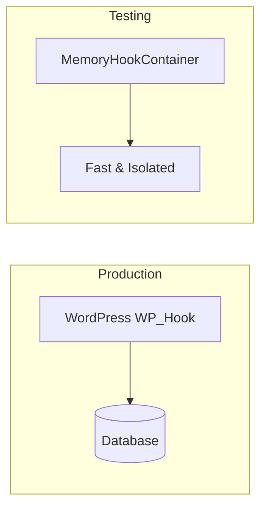

# Testing with Memory Infrastructure

This guide explains how to use the memory infrastructure package for testing hook-based code.

## Why Use Memory Infrastructure for Testing?



The memory infrastructure provides:

- **Speed**: No database or file I/O
- **Isolation**: Each test gets a fresh hook state
- **Predictability**: No external state affecting tests
- **Simplicity**: No WordPress bootstrap required

---

## Setup for Pest/PHPUnit

### Basic Test Setup

```php
<?php

declare(strict_types=1);

use SpeedySpec\WP\Hook\Domain\Entities\ObjectHookInvoke;
use SpeedySpec\WP\Hook\Domain\Services\CurrentHookService;
use SpeedySpec\WP\Hook\Domain\Services\HookRunAmountService;
use SpeedySpec\WP\Hook\Domain\ValueObject\StringHookName;
use SpeedySpec\WP\Hook\Infra\Memory\Services\MemoryHookContainer;

beforeEach(function () {
    // Create fresh instances for each test
    $this->hookRunAmountService = new HookRunAmountService();
    $this->currentHookService = new CurrentHookService();
    $this->container = new MemoryHookContainer(
        $this->hookRunAmountService,
        $this->currentHookService
    );
});

test('filters modify values correctly', function () {
    $hookName = new StringHookName('my_filter');
    $callback = new ObjectHookInvoke(fn($v) => strtoupper($v), priority: 10);

    $this->container->add($hookName, $callback);
    $result = $this->container->filter($hookName, 'hello');

    expect($result)->toBe('HELLO');
});
```

### PHPUnit Test Case

```php
<?php

declare(strict_types=1);

namespace MyApp\Tests;

use PHPUnit\Framework\TestCase;
use SpeedySpec\WP\Hook\Domain\Entities\ObjectHookInvoke;
use SpeedySpec\WP\Hook\Domain\Services\CurrentHookService;
use SpeedySpec\WP\Hook\Domain\Services\HookRunAmountService;
use SpeedySpec\WP\Hook\Domain\ValueObject\StringHookName;
use SpeedySpec\WP\Hook\Infra\Memory\Services\MemoryHookContainer;

class MyHookTest extends TestCase
{
    private MemoryHookContainer $container;
    private HookRunAmountService $hookRunAmountService;
    private CurrentHookService $currentHookService;

    protected function setUp(): void
    {
        parent::setUp();

        $this->hookRunAmountService = new HookRunAmountService();
        $this->currentHookService = new CurrentHookService();
        $this->container = new MemoryHookContainer(
            $this->hookRunAmountService,
            $this->currentHookService
        );
    }

    public function testFilterModifiesValue(): void
    {
        $hookName = new StringHookName('test_filter');
        $callback = new ObjectHookInvoke(fn($v) => $v . '_modified', priority: 10);

        $this->container->add($hookName, $callback);
        $result = $this->container->filter($hookName, 'original');

        $this->assertEquals('original_modified', $result);
    }
}
```

---

## Testing Patterns

### Testing Filter Chains

```php
test('filters execute in priority order', function () {
    $hookName = new StringHookName('chain_filter');

    // Add filters in random order
    $this->container->add(
        $hookName,
        new ObjectHookInvoke(fn($v) => $v . '_third', priority: 30)
    );
    $this->container->add(
        $hookName,
        new ObjectHookInvoke(fn($v) => $v . '_first', priority: 10)
    );
    $this->container->add(
        $hookName,
        new ObjectHookInvoke(fn($v) => $v . '_second', priority: 20)
    );

    $result = $this->container->filter($hookName, 'start');

    expect($result)->toBe('start_first_second_third');
});
```

### Testing Action Side Effects

```php
test('action callbacks are executed', function () {
    $hookName = new StringHookName('test_action');
    $callLog = [];

    $callback = new ObjectHookInvoke(function ($arg) use (&$callLog) {
        $callLog[] = $arg;
    }, priority: 10);

    $this->container->add($hookName, $callback);
    $this->container->dispatch($hookName, 'event_1');
    $this->container->dispatch($hookName, 'event_2');

    expect($callLog)->toBe(['event_1', 'event_2']);
});
```

### Testing Hook Run Count

```php
test('tracks hook execution count', function () {
    $hookName = new StringHookName('counted_hook');
    $callback = new ObjectHookInvoke(fn() => null, priority: 10);

    $this->container->add($hookName, $callback);

    expect($this->hookRunAmountService->getRunAmount($hookName))->toBe(0);

    $this->container->dispatch($hookName);
    expect($this->hookRunAmountService->getRunAmount($hookName))->toBe(1);

    $this->container->dispatch($hookName);
    expect($this->hookRunAmountService->getRunAmount($hookName))->toBe(2);
});
```

### Testing Current Hook Tracking

```php
test('tracks currently executing hook', function () {
    $hookName = new StringHookName('tracked_hook');
    $capturedHookName = null;

    $callback = new ObjectHookInvoke(function () use (&$capturedHookName) {
        $capturedHookName = $this->currentHookService->getCurrentHook()?->getName();
    }, priority: 10);

    $this->container->add($hookName, $callback);
    $this->container->dispatch($hookName);

    expect($capturedHookName)->toBe('tracked_hook');
});
```

### Testing Callback Removal

```php
test('removed callbacks are not executed', function () {
    $hookName = new StringHookName('removable_hook');
    $callCount = 0;

    $callback = new ObjectHookInvoke(function () use (&$callCount) {
        $callCount++;
    }, priority: 10);

    $this->container->add($hookName, $callback);
    $this->container->remove($hookName, $callback);
    $this->container->dispatch($hookName);

    expect($callCount)->toBe(0);
});
```

---

## Testing MemoryHookSubject Directly

For more granular tests, you can test `MemoryHookSubject` directly:

```php
use SpeedySpec\WP\Hook\Infra\Memory\Services\MemoryHookSubject;

test('subject sorts callbacks by priority', function () {
    $currentHookService = new CurrentHookService();
    $subject = new MemoryHookSubject($currentHookService);
    $executionOrder = [];

    $subject->add(new ObjectHookInvoke(function ($v) use (&$executionOrder) {
        $executionOrder[] = 'C';
        return $v;
    }, priority: 30));

    $subject->add(new ObjectHookInvoke(function ($v) use (&$executionOrder) {
        $executionOrder[] = 'A';
        return $v;
    }, priority: 10));

    $subject->add(new ObjectHookInvoke(function ($v) use (&$executionOrder) {
        $executionOrder[] = 'B';
        return $v;
    }, priority: 20));

    $subject->filter('value');

    expect($executionOrder)->toBe(['A', 'B', 'C']);
});
```

---

## Creating Test Helpers

### Mock Action Helper

The package tests include a helpful mock factory:

```php
function createMockAction(): object
{
    return new class {
        private int $callCount = 0;
        private array $events = [];

        public function action(...$args): void
        {
            $this->callCount++;
            $this->events[] = ['type' => 'action', 'args' => $args];
        }

        public function filter(...$args): mixed
        {
            $this->callCount++;
            $this->events[] = ['type' => 'filter', 'args' => $args];
            return $args[0] ?? null;
        }

        public function getCallCount(): int
        {
            return $this->callCount;
        }

        public function getEvents(): array
        {
            return $this->events;
        }
    };
}

// Usage in tests
test('callback is executed with correct arguments', function () {
    $mock = createMockAction();
    $hookName = new StringHookName('test_hook');
    $callback = new ArrayHookInvoke([$mock, 'filter'], priority: 10);

    $this->container->add($hookName, $callback);
    $this->container->filter($hookName, 'value', 'extra_arg');

    expect($mock->getCallCount())->toBe(1);
    expect($mock->getEvents()[0]['args'])->toBe(['value', 'extra_arg']);
});
```

### Assertion Helpers

```php
// Custom assertion for hook execution
function assertHookExecuted(
    MemoryHookContainer $container,
    HookRunAmountService $service,
    string $hookName,
    int $expectedCount = 1
): void {
    $count = $service->getRunAmount(new StringHookName($hookName));
    expect($count)->toBe($expectedCount, "Hook '$hookName' should have run $expectedCount time(s)");
}

// Usage
test('hook runs expected number of times', function () {
    $hookName = new StringHookName('my_hook');
    $this->container->add($hookName, new ObjectHookInvoke(fn() => null));

    $this->container->dispatch($hookName);
    $this->container->dispatch($hookName);

    assertHookExecuted($this->container, $this->hookRunAmountService, 'my_hook', 2);
});
```

---

## Testing Classes That Use Hooks

When testing classes that depend on hooks, inject the container:

```php
// Class that uses hooks
class ContentProcessor
{
    public function __construct(
        private HookContainerInterface $hooks
    ) {}

    public function process(string $content): string
    {
        return $this->hooks->filter(
            new StringHookName('process_content'),
            $content
        );
    }
}

// Test
test('ContentProcessor applies filters', function () {
    $processor = new ContentProcessor($this->container);

    // Add a filter
    $this->container->add(
        new StringHookName('process_content'),
        new ObjectHookInvoke(fn($c) => strtoupper($c), priority: 10)
    );

    $result = $processor->process('hello world');

    expect($result)->toBe('HELLO WORLD');
});

test('ContentProcessor returns original when no filters', function () {
    $processor = new ContentProcessor($this->container);

    $result = $processor->process('hello world');

    expect($result)->toBe('hello world');
});
```

---

## Best Practices

1. **Always use fresh instances per test** - Don't share container state between tests
2. **Store callback references** - Keep references to callbacks you need to remove later
3. **Test priority ordering** - Verify callbacks execute in expected order
4. **Test empty hook behavior** - Ensure code handles hooks with no callbacks
5. **Use meaningful hook names** - Make test output easier to debug
6. **Test callback arguments** - Verify callbacks receive expected arguments
